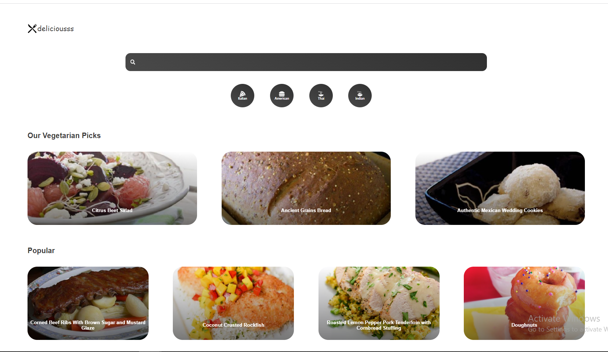
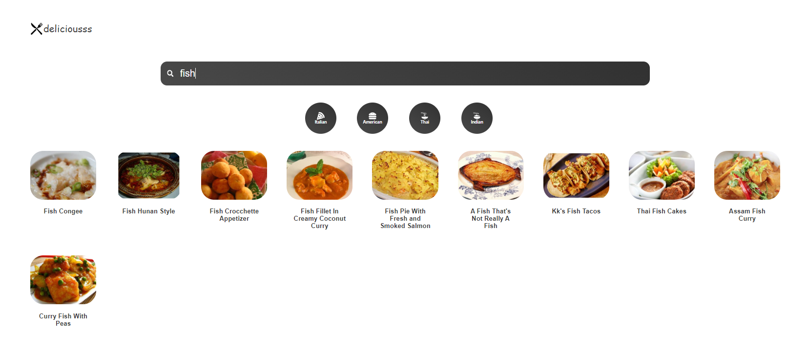
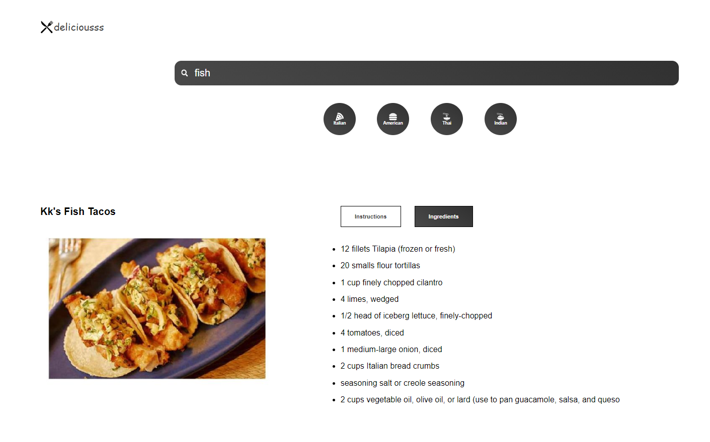

# Welcome to the delicious App
This React application provides details regarding recipes of various dishes!

## Install the dependencies
```
npm install
```

## Run the server
```
npm run start
```


## Preview


<table>
  <tr>
     <td>Home Page</td>
  </tr>
  <tr>
    <td></td>
  </tr>
</table>

<table>
  <tr>
     <td>Search Function</td>
  </tr>
  <tr>
    <td></td>
  </tr>
</table>

<table>
  <tr>
     <td>Recipe Page</td>
  </tr>
  <tr>
    <td></td>
  </tr>
</table>


